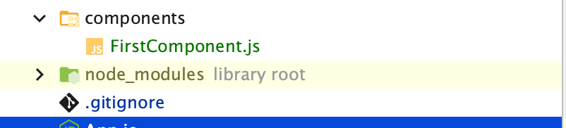

# 1_komponenter_vejledning
### Components, props, states og assets

#### slut resultat


# Læs om Components og Views 
Læs om Core-Components her https://reactnative.dev/docs/intro-react-native-components
og her https://reactnative.dev/docs/components-and-apis
og evt. her https://reactjs.org/docs/components-and-props.html

Læs mere om View her https://reactnative.dev/docs/view
Til dette fag, benytter vi os primært af Functions Komponenter


# Component

1. Lav et nyt expo projekt i din projekt mappe med `npx create-expo-app <navnet på din app. f.eks. 1_komponenter>`og åben projektet i webstorm


2. Opret en mappe i dit nyoprettet projekt ved navn components 


3. Lav en ny komponent kaldt "FirstComponent", og brug templaten nederst i guiden. Tilføj nu et `<Text></Text>` element i return  
    
    Sørg for at importere `Text` øverst!


4. Importer din komponent i App.js og implementer den i App.js’ return funktion i viewet. (Husk at return() kun kan returnere ét parent-element | evt google hvad et parent element og children elementer er)
    `import FirstComponent from "./components/FirstComponent";`
    `<FirstComponent/>`


5.	Kør appen og se om den viser teksten (hvis den ikke viser teksten, læs hvad react native giver og fejl og fiks)

      
6.	Lav nu en komponent kaldt PropsComponent og brug komponent templaten. I templaten skrives nu `const {name} = props ` over return funktionen. Og lav nu et `<Text></Text>` element som indeholder en prop, der kaldes "name". name modtager argumentet, `{name}`, hvorefter denne importeres i App.js - på samme måde, som med  FirstComponent.


7.	I App.js skal værdien af name-argumentet defineres; ´<PropComponent name={'Jeres navne'}/>´


8.	Kør appen og se om den viser teksten, som du har angivet i App.js.


9.	Opret flere instanser af din komponent i App.js’ return() og send forskellige tekster til hver af dem
      

10.	Opret nu en ny komponent kaldet ´ButtonComponent´. Deri laves en const instans, active, ved brug af useState(). active skal i udgangspunkt have værdien false:  `const [active, setActive] = useState(false)`


10. b) 	Opret nu et `Text` element, der indeholder en conditional render funktion med en tilhørende knap, som kan ændre på active Staten
    1. læs mere https://reactjs.org/docs/conditional-rendering.html#inline-if-else-with-conditional-operator ( se bort fra this.state)

    
11.	En Button skal altid have en title og en onPress prop. Til onPress vil vi ændre status på active med setActive: `onPress={()=> setActive(!active)}`  funktionen.
    1. Prøv at se om du kan forklare hvad der sker i onpress funktionen 

12.	Importer nu `ButtonComponent` i App.js, og test din nye knap


13. Opret nu en ny komponent der kaldes ´InputComponent´. Deri laves en ny const instans, inputValue, ved brug af useState(). inputValue skal som udgangspunkt værdisættes ved brug af en tom string "";
    1. se punkt 10
    2. Huks at importere dine components øverst
    3. `import React, {useState} from 'react'`
        `import {Text, TextInput, View} from 'react-native'`


14. I din `<View></View>` i InputComponent laves et TextInput felt med et `style prop, onChangeText og value`. Udfyld onChangeText med setInputValue funktionen: `onChangeText={(txt) => setInputValue(txt)}`. Values egenskaben sættes lig med inputValue fx: `value={inputValue}`
    Prøv jer frem med stylingen
    Læs mere https://reactnative.dev/docs/textinput
    1. Husk at importere TextInput øverst
       

15. Importer nu `InputComponent` ind i App.js, og test dit nye input felt


16. Opret en ny komponent ved navn `AssetComponent` i Components, og indsæt `url` som prop.


17. I `<View></View>` hentes et Image element. Heri oprettes en src-prop: `source{url}` Læs mere https://reactnative.dev/docs/image
    1. prøv jer frem med stylingen af billedet


16. Import et billede fra assets mappen øverst i App.js: `import FirstImage from "./assets/favicon.png"` , og derefter importer AssetComponent og placer den i return funktionen med proppen url

17. Giv nu `AssetComponent`, FirstImage som url værdien --> `<AssetComponent url={FirstImage}/> `
    (Vigtigt: giv width og height til Image)
    
18. Overfør til sidst dit eget billede til projekt mappen og få det vist i din app


**Ekstra:** Til sidst lav nu en multi funktions komponent hvor du anvender input, output og en knap f.eks. til at brugeren indtaster en tekst som konfirmeres eller noget helt andet
 

       
#### Tips
- Brug console.log(værdi) til når du debugger
- Læs i appen hvad react native brokker sig over 
- Læs docsen inde på https://reactnative.dev/docs/getting-started 

#### Komponent template

```
import React from 'react';
import { StyleSheet, View} from 'react-native';

{/*HUSK AT SKIFTE NAVN*/}
const FirstComponent = (props) => {

    return (
            <View style={styles.container}>
               {/*alt vores content*/}
            </View>
    );
}

{/*HUSK AT SKIFTE NAVN*/}
export default FirstComponent;

const styles = StyleSheet.create({
    container: {
        flex: 1,
        backgroundColor: '#fff',
        alignItems: 'center',
        justifyContent: 'center',
    },
});
`


